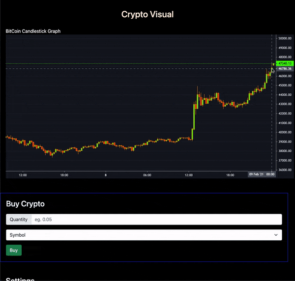
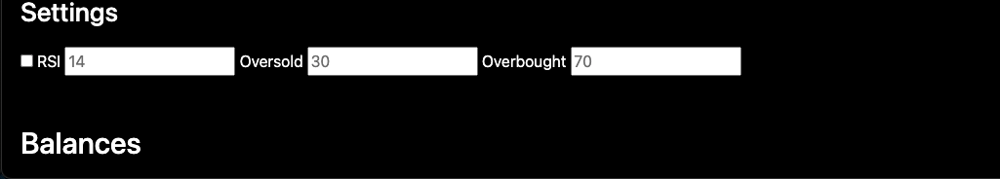

# Crypto Currency Trading Web Application

### Overview
In this application, user will be able to get real-time updates of a crypto and is presented in a candlestick graph. The web app uses the Binance API to fetch data. Users can also buy specific crypto with their desired quantity.

### Built with:
- [Python]()
- [JavaScript]()
- [HTML]()
- [CSS]()
- [Boostrap](https://getbootstrap.com/)
- [Flask](https://flask.palletsprojects.com/en/1.1.x/quickstart/)
- [Jinja](https://jinja.palletsprojects.com/en/2.11.x/)
- [TA-Lib](https://mrjbq7.github.io/ta-lib/doc_index.html)
- [backtrader](https://github.com/mementum/backtrader)
- [Binance API](https://github.com/binance/binance-spot-api-docs/blob/master/rest-api.md)
- [Lightweight Charts](https://www.tradingview.com/lightweight-charts/)

### Next Steps:
- Make a dropdown that allows users to view the graph of other cryptos
- Add algorithms like RSI and MSE that analyze the trend
- Upgrade it to a trading bot!
